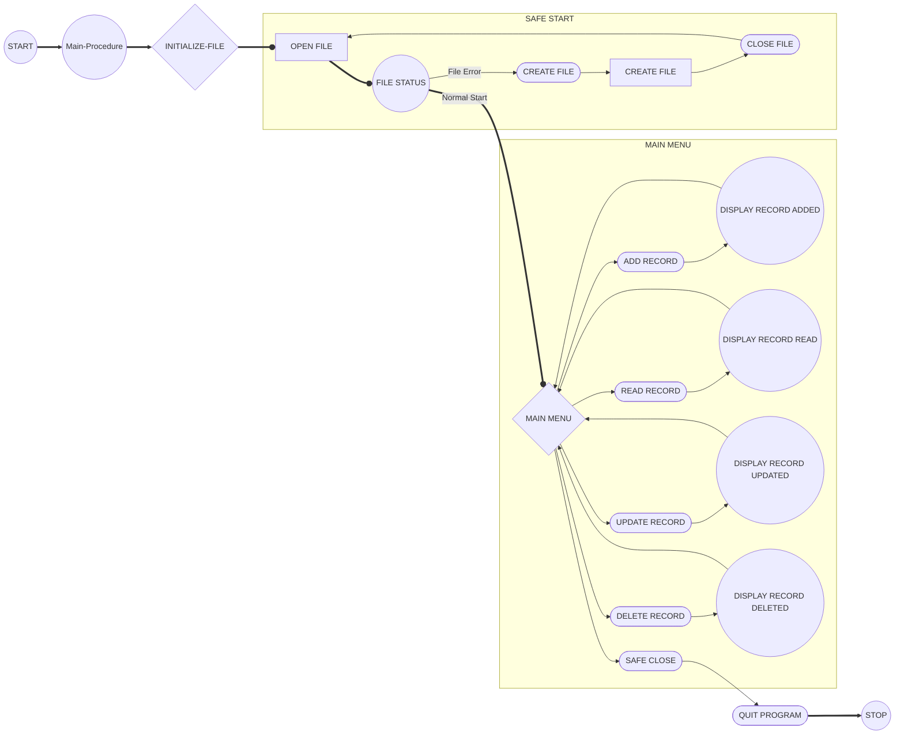

# MERMAID EXAMPLE ON COBOL DIAGRAM;

```mermaid

graph LR;
    A((START));
    B[OPEN FILE];
    C{INITIALIZE-FILE};
    D{MAIN MENU};
    E([CREATE FILE]);
    F([ADD RECORD]);
    G([READ RECORD]);
    H([UPDATE RECORD]);
    I([DELETE RECORD]);
    J([SAFE CLOSE]);
    K([QUIT PROGRAM]);
    L[CREATE FILE];
    L1((FILE STATUS));
    L2([CLOSE FILE]);

    Z((STOP));

    Main-Procedure((Main-Procedure));

    DISPLAY-RECORD1((DISPLAY RECORD ADDED));
    DISPLAY-RECORD2((DISPLAY RECORD READ));
    DISPLAY-RECORD3((DISPLAY RECORD UPDATED));
    DISPLAY-RECORD4((DISPLAY RECORD DELETED));

    A==>Main-Procedure;
    Main-Procedure==>C;
    C==oB;
    B==oL1;
    L1==o|Normal Start|D;
    D-->F;
    D-->G;
    D-->H;
    D-->I;
    L1-->|File Error|E;
    E-->L;
    L-->L2;
    L2-->B;
    J-->K;
    D-->J;
    K==>Z;
    F-->DISPLAY-RECORD1;
    DISPLAY-RECORD1-->D;
    G-->DISPLAY-RECORD2;
    DISPLAY-RECORD2-->D;
    H-->DISPLAY-RECORD3;
    DISPLAY-RECORD3-->D;
    I-->DISPLAY-RECORD4;
    DISPLAY-RECORD4-->D;

    subgraph MAIN MENU
         D; F; G; H; I; J; DISPLAY-RECORD1; DISPLAY-RECORD2; DISPLAY-RECORD3; DISPLAY-RECORD4;
    end

    subgraph SAFE START
         B; E; L1; L; L2;
    end
   
```
