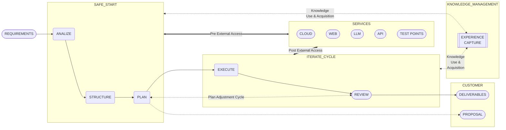

# COBOL AGENCY ASPER PROCESS

```mermaid
flowchart LR

CLOUD([CLOUD])
WEB([WEB])     
LLM([LLM])
API([API])
TP([TEST POINTS])

R0([REQUIREMENTS]) --> A(ANALIZE) --> S(STRUCTURE) --> P(PLAN) --> E(EXECUTE) --> R([REVIEW]) --> D([DELIVERABLES ])
P ..-> PR

PR([PROPOSAL])

EX[[EXPERIENCE<br/>CAPTURE]]

SAFE_START <-..->|Knowledge<br/>Use & Acquisition| EX
ITERATE_CYCLE <-..->|Knowledge<br/>Use &<br/>Acquisition| EX

subgraph SERVICES
           CLOUD; WEB; LLM; API; TP
end

subgraph SAFE_START
      direction LR
       A; S; P;
end

subgraph ITERATE_CYCLE
      direction TB
       E; R; 
end

subgraph KNOWLEDGE_MANAGEMENT
     EX
end

subgraph CUSTOMER
       D; PR
end

P <-..->|Plan Adjustment Cycle| R

SAFE_START <==>|Pre External Access| SERVICES
ITERATE_CYCLE<==>|Post External Access| SERVICES
```