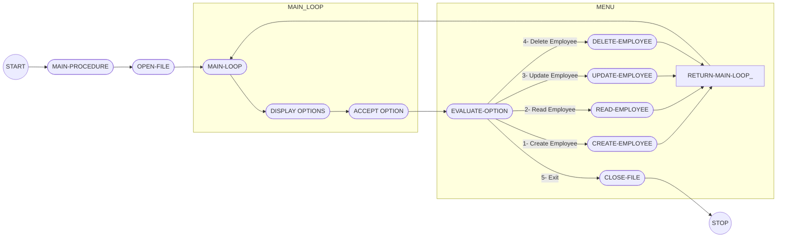

# CRUD NICE EXAMPLE

```mermaid
graph LR
    Start((START)) --> MAIN-PROCEDURE([MAIN-PROCEDURE])
    MAIN-PROCEDURE --> OPEN-FILE([OPEN-FILE])
    OPEN-FILE --> MAIN-LOOP([MAIN-LOOP])
    MAIN-LOOP --> DISPLAY-OPTIONS_([DISPLAY OPTIONS])
    DISPLAY-OPTIONS_ --> ACCEPT-OPTION_([ACCEPT OPTION])
    ACCEPT-OPTION_ --> EVALUATE-OPTION_([EVALUATE-OPTION])
    EVALUATE-OPTION_ -->|1- Create Employee | CREATE-EMPLOYEE_([CREATE-EMPLOYEE])
    EVALUATE-OPTION_ -->|2- Read Employee    | READ-EMPLOYEE_([READ-EMPLOYEE])
    EVALUATE-OPTION_ -->|3- Update Employee| UPDATE-EMPLOYEE_([UPDATE-EMPLOYEE])
    EVALUATE-OPTION_ -->|4- Delete Employee  | DELETE-EMPLOYEE_([DELETE-EMPLOYEE])
    EVALUATE-OPTION_ -->|5- Exit| CLOSE-FILE_([CLOSE-FILE])
    RETURN-MAIN-LOOP_ --> MAIN-LOOP
    CREATE-EMPLOYEE_ --> RETURN-MAIN-LOOP_
    READ-EMPLOYEE_ --> RETURN-MAIN-LOOP_
    UPDATE-EMPLOYEE_ --> RETURN-MAIN-LOOP_
    DELETE-EMPLOYEE_ --> RETURN-MAIN-LOOP_
    CLOSE-FILE_ --> STOP((STOP))

subgraph MAIN_LOOP
     MAIN-LOOP; DISPLAY-OPTIONS_; ACCEPT-OPTION_;
end

subgraph MENU
   EVALUATE-OPTION_ ;
   CREATE-EMPLOYEE_;
   READ-EMPLOYEE_;
   UPDATE-EMPLOYEE_;
   DELETE-EMPLOYEE_;
   CLOSE-FILE_;
   RETURN-MAIN-LOOP_;
end
```

